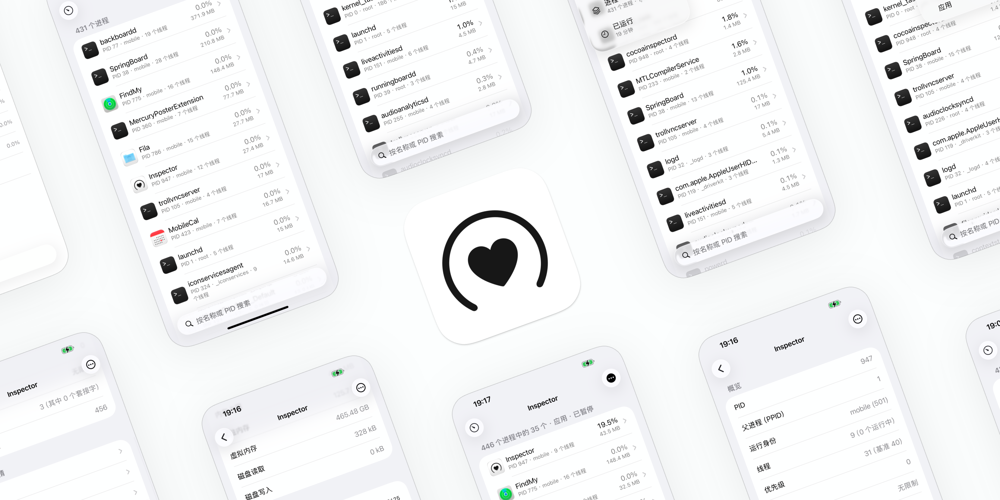

<p align="center">
  <a href="README.md">English</a> |
  <a href="README_zh-Hans.md">简体中文</a>
</p>

# Inspector

查看越狱 iPhone 或 iPad 上运行的进程。通过实时列表监测 CPU 占用、内存、线程数和进程所有者，并查看各进程的线程、文件、端口和已加载模块。



## 安装

在 Sileo、Zebra 或其他包管理器中添加 OwnGoal Studio 软件源：

**[添加到 Sileo](sileo://source/https://apt.owngoal.dev)** · [apt.owngoal.dev](https://apt.owngoal.dev/)

也可从 [GitHub Releases](https://github.com/owngoal-dev/CocoaInspector/releases) 下载。请选择与越狱匹配的文件。

| 越狱 | 软件包 |
| --- | --- |
| [roothide](https://github.com/roothide) | `iphoneos-arm64e` |
| Rootless（`/var/jb`） | `iphoneos-arm64` |

需要 iOS 16 或更高版本。Inspector 不适用于 App Store。

## 功能

- **实时进程列表**：查看 CPU 占用、内存、线程数和进程所有者，每秒更新。可暂停更新以查看当前列表。
- **查找进程**：按名称或 PID 搜索，按 CPU 占用、内存、PID 或名称排序，并筛选系统、用户或应用进程。
- **进程详情**：线程、打开的文件和套接字、Mach 端口、已加载模块、沙盒状态，以及磁盘和网络使用情况。
- **停止进程**：在详情页请求退出或强制退出。无法停止 PID 1。
- **导出**：将进程快照共享为文件。
- **命令行**：通过 `cocoainspector` 在终端中查看进程信息并监测 CPU 占用。

## 命令行

```sh
sudo cocoainspector list
sudo cocoainspector inspect 1
sudo cocoainspector details 1 all
sudo cocoainspector watch --count 10 --interval-ms 1000
sudo cocoainspector self-test
```

`self-test` 为只读。仅在需要用 CLI 的子进程验证「请求退出」和「强制退出」时加上 `--signal`，它不会针对系统进程。

在 rootless 越狱上，该工具位于 `/var/jb/usr/bin/cocoainspector`。

## 从源码构建

需要安装 Xcode、`ldid` 和 `dpkg-deb` 的 macOS。

```sh
make deb              # roothide
make deb FLAVOR=rootless
make deb-all          # 两个软件包
make harness          # 在 Mac 上运行数据层测试
```

贡献说明见 [AGENTS.md](AGENTS.md)。守护进程设计见 [Documents/Daemon-XPC-Architecture.md](Documents/Daemon-XPC-Architecture.md)。

## 许可证

Inspector 使用 [MIT 许可证](LICENSE)。

欢迎加入 [Discord](https://discord.gg/vqhDEep2mN) 社区。
